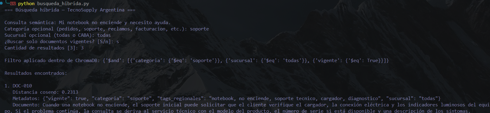

# Proyecto Final — Sistema Inteligente de Clasificación de Emails Empresariales

# Parte A — Embeddings y Búsqueda Semántica

## A.1 — Autopsia del contexto estático

Para medir el impacto real de incluir toda la Base de Conocimiento dentro del prompt, se ejecutó `tests/token_test.py` utilizando el modelo `gemini-2.5-flash`.

La base de conocimiento contiene 15 documentos. La medición obtuvo los siguientes resultados:

```text
Tokens de la base completa: 2407
Tokens del prompt estático completo: 2488
Costo estimado por consulta: USD 0.000746
Costo estimado por 1.000 consultas: USD 0.7464
```

El costo se calculó usando el precio de entrada estándar de Gemini 2.5 Flash: USD 0,30 por cada millón de tokens de entrada. El cálculo contempla únicamente los tokens de entrada; no incluye los tokens de salida generados por el modelo.

| Problema | Aplicado a TecnoSupply Argentina |
|---|---|
| Desangre de tokens | La base actual de 15 documentos consume 2407 tokens. Al incluir también instrucciones y una consulta de ejemplo, el prompt estático alcanza 2488 tokens. Esto ocurre en cada interacción aunque el cliente solo necesite información sobre soporte, facturación o envíos. Con la tarifa de referencia, el costo estimado es USD 0,000746 por consulta y USD 0,7464 por cada 1000 consultas, sin incluir la respuesta generada. A medida que se agreguen políticas, productos, sucursales y procedimientos, este costo y la latencia crecerán de forma lineal. |
| Lost in the Middle | Si el cliente consulta por una notebook que no enciende, el documento relevante de soporte puede quedar entre políticas de envío, facturación, garantías, pagos y retiro. Aunque el modelo reciba toda la información, puede prestar menos atención al contenido relevante si este se encuentra en el medio de un bloque extenso. |
| Inconsistencia de estado concurrente | Datos como el estado de un pedido, el stock disponible, una fecha de entrega o las condiciones de una devolución pueden cambiar mientras el cliente mantiene una conversación. Un prompt estático podría conservar información desactualizada y responder con una política o disponibilidad que ya no representa el estado real del negocio. |

Un `SELECT ... WHERE descripcion LIKE '%...%'` tampoco resuelve el problema porque busca coincidencias literales, no significado. Por ejemplo, una consulta como “la portátil quedó muerta” no contiene exactamente “notebook no enciende”, aunque ambas expresen la misma necesidad de soporte. Además, `LIKE` no combina de forma natural la similitud semántica con filtros de negocio como categoría, vigencia o sucursal.

> Referencia de precio: [Gemini Developer API Pricing](https://ai.google.dev/gemini-api/docs/pricing).

## A.2 — Similitud coseno a mano

Para representar de forma simplificada el dominio de TecnoSupply Argentina se definieron dos ejes semánticos:

- **Eje X:** relación con pedidos, envíos y logística.
- **Eje Y:** relación con soporte técnico de productos.

Se representan los siguientes documentos y consulta mediante vectores bidimensionales:

| Elemento | Descripción | Vector |
|---|---|---|
| Documento 1 | Política de seguimiento y entrega de pedidos. | `D1 = (0.95, 0.10)` |
| Documento 2 | Guía de soporte para notebooks que no encienden. | `D2 = (0.15, 0.95)` |
| Documento 3 | Política de devolución de productos dañados. | `D3 = (0.65, 0.40)` |
| Consulta | “Mi notebook no enciende y necesito asistencia técnica.” | `Q = (0.10, 0.98)` |

La fórmula utilizada es:

```text
Similitud coseno = (A · B) / (||A|| × ||B||)
```

### Comparación entre la consulta y el Documento 1

**Paso 1 — Producto punto**

```text
Q · D1 = (0.10 × 0.95) + (0.98 × 0.10)
Q · D1 = 0.193
```

**Paso 2 — Magnitudes**

```text
||Q|| = √(0.10² + 0.98²) = 0.985

||D1|| = √(0.95² + 0.10²) = 0.955
```

**Paso 3 — Similitud coseno**

```text
Similitud(Q, D1) = 0.193 / (0.985 × 0.955)

Similitud(Q, D1) = 0.205
```

### Comparación entre la consulta y el Documento 2

**Paso 1 — Producto punto**

```text
Q · D2 = (0.10 × 0.15) + (0.98 × 0.95)
Q · D2 = 0.946
```

**Paso 2 — Magnitudes**

```text
||Q|| = 0.985

||D2|| = √(0.15² + 0.95²) = 0.962
```

**Paso 3 — Similitud coseno**

```text
Similitud(Q, D2) = 0.946 / (0.985 × 0.962)

Similitud(Q, D2) = 0.999
```

### Comparación entre la consulta y el Documento 3

**Paso 1 — Producto punto**

```text
Q · D3 = (0.10 × 0.65) + (0.98 × 0.40)
Q · D3 = 0.457
```

**Paso 2 — Magnitudes**

```text
||Q|| = 0.985

||D3|| = √(0.65² + 0.40²) = 0.763
```

**Paso 3 — Similitud coseno**

```text
Similitud(Q, D3) = 0.457 / (0.985 × 0.763)

Similitud(Q, D3) = 0.608
```

### Resultado

| Documento | Similitud coseno con la consulta |
|---|---:|
| Documento 1 — Seguimiento de pedidos | 0.205 |
| Documento 2 — Soporte para notebook | 0.999 |
| Documento 3 — Devoluciones | 0.608 |

El Documento 2 es el más similar porque está relacionado directamente con soporte técnico para una notebook que no enciende.

### Validación con NumPy

```python
import numpy as np

def similitud_coseno(a, b):
    return np.dot(a, b) / (np.linalg.norm(a) * np.linalg.norm(b))

documento_1 = np.array([0.95, 0.10])
documento_2 = np.array([0.15, 0.95])
documento_3 = np.array([0.65, 0.40])
consulta = np.array([0.10, 0.98])

print("D1:", similitud_coseno(consulta, documento_1))
print("D2:", similitud_coseno(consulta, documento_2))
print("D3:", similitud_coseno(consulta, documento_3))
```

La ejecución con NumPy devuelve aproximadamente los siguientes valores:

```text
D1: 0.205
D2: 0.999
D3: 0.608
```

Los resultados obtenidos con NumPy coinciden con los cálculos realizados manualmente.

### Umbral de aceptación

Para este sistema se podría utilizar inicialmente un umbral de aceptación de `0.80`. Un documento con un score igual o superior a ese valor se considera suficientemente relacionado con la consulta; por debajo de ese umbral no debería utilizarse como fuente confiable para responder.

Si ningún documento supera el umbral, el sistema no debe inventar una respuesta. Debe solicitar más información al cliente, derivar el caso a un empleado o responder que no cuenta con información suficiente.

## A.3 — Base de Conocimiento

La Base de Conocimiento de TecnoSupply Argentina se implementa mediante el archivo `base_conocimiento.json`, compuesto por 15 documentos relacionados con pedidos, envíos, reclamos, facturación, garantía, soporte técnico, stock, pagos, retiro en sucursal y horarios de atención.

Cada documento contiene un identificador, una `descripcion_semantica` redactada como un párrafo con contexto y vocabulario del dominio, y un bloque de `metadatos`.

Se aplicó la Regla del Arquitecto para definir el esquema. Los campos que pueden requerir filtros exactos se guardan como metadatos: `categoria` permite filtrar por tipo de información, `vigente` indica si el documento puede utilizarse y `sucursal` permite restringir información según la ubicación. El campo `tags_regionales` incorpora términos locales, sinónimos y expresiones habituales en Argentina.

La información narrativa, como procedimientos, condiciones, explicaciones y matices de cada política, se mantiene en `descripcion_semantica`. Este campo será transformado en embeddings para permitir búsquedas por significado.

## A.4 

### Resultados de las consultas de prueba

El script construyó un índice FAISS con los 15 documentos de `base_conocimiento.json`. Se utilizó `IndexFlatL2` con vectores normalizados y se realizaron tres búsquedas semánticas con los tres resultados más cercanos (`top-K = 3`).

En esta métrica, una distancia L2 menor indica una mayor cercanía semántica entre la consulta y el documento recuperado.

| Consulta | Ranking | Documento recuperado | Categoría | Distancia L2 | Interpretación |
|---|---:|---|---|---:|---|
| “¿Dónde está mi pedido #4587 y cuándo llegará?” | 1 | `DOC-002` | envíos | 0.5616 | Recuperó información sobre entregas, seguimiento y plazos. |
|  | 2 | `DOC-001` | pedidos | 0.5742 | Recuperó el procedimiento de consulta de estado de pedido. |
|  | 3 | `DOC-003` | envíos | 0.6381 | Recuperó el procedimiento ante demoras de entrega. |
| “Mi notebook no enciende y necesito asistencia técnica.” | 1 | `DOC-010` | soporte | 0.3878 | Recuperó correctamente el procedimiento de soporte para una notebook que no enciende. |
|  | 2 | `DOC-009` | garantía | 0.6075 | Recuperó información relacionada con garantía y diagnóstico técnico. |
|  | 3 | `DOC-014` | atención | 0.7570 | Recuperó información general sobre la atención al cliente. |
| “El producto llegó roto y quiero devolverlo.” | 1 | `DOC-005` | reclamos | 0.5042 | Recuperó correctamente el procedimiento para reclamo, devolución o reintegro por producto dañado. |
|  | 2 | `DOC-004` | pedidos | 0.6439 | Recuperó información relacionada con cancelaciones y devoluciones. |
|  | 3 | `DOC-009` | garantía | 0.7033 | Recuperó información complementaria sobre cobertura y evaluación técnica. |

Los resultados muestran que el índice FAISS recuperó como primer resultado el documento más pertinente en las tres consultas. Los siguientes resultados también pertenecen a categorías relacionadas, aunque presentan una distancia mayor y, por lo tanto, una menor relevancia semántica.

## A.5 — Prueba destructiva: volatilidad de la RAM

### Prueba sin persistencia

Se creó el script `prueba_sin_persistencia.py`, que genera los embeddings de los 15 documentos y construye un índice `IndexFlatL2` únicamente en memoria RAM. El script no utiliza `faiss.write_index()` ni guarda ningún archivo de índice.

Al ejecutar el programa por primera vez se obtuvo el siguiente resultado:

```text
Generando embeddings y construyendo el índice solamente en RAM...
Índice creado en RAM con 15 documentos.
No se ejecutó faiss.write_index().
Al finalizar este programa, el índice se perderá.
```

Luego de finalizar el programa y ejecutar nuevamente el mismo script, fue necesario generar otra vez los embeddings y reconstruir el índice. Esto demuestra que el índice almacenado solamente en RAM se pierde cuando termina o se reinicia el proceso.

### Prueba con persistencia

Luego se ejecutó `pipeline_vectorial.py`, que utiliza `faiss.write_index()` para guardar el índice en el archivo `indice_faiss.index`.

En una ejecución posterior, el sistema mostró:

```text
Índice FAISS cargado desde disco. No se generaron embeddings nuevos.
```

Además, el archivo `documentos_indexados.json` permitió recuperar la relación entre las posiciones de los vectores y los documentos originales de la base de conocimiento.

### Conclusión

En producción, si el servidor se reinicia y el índice existe solamente en RAM, se pierde y deben regenerarse los embeddings, lo cual agrega demora y consumo de recursos. Si existen dos servidores, ambos deben acceder a un almacenamiento compartido o a una base vectorial centralizada; de lo contrario, cada servidor podría tener una versión distinta o incompleta del índice.

# Parte B — ChromaDB, Filtrado Híbrido y ETL (Clase 5)

## B.1 — Migración a ChromaDB

Se migró la misma base de conocimiento utilizada en A.3, compuesta por 15 documentos, a una colección persistente de ChromaDB denominada `conocimiento_tecnosupply`.

La conexión se realizó mediante `chromadb.PersistentClient`, con la ruta local `chroma_db/`. De esta forma, la colección y sus vectores permanecen disponibles en disco luego de finalizar el programa.

La colección fue creada con la configuración:

```python
metadata={"hnsw:space": "cosine"}
```

Se utilizaron los embeddings generados previamente con el modelo `gemini-embedding-001`. Cada registro fue almacenado con:

- `id`: identificador único del documento.
- `document`: contenido de `descripcion_semantica`.
- `embedding`: vector generado por Gemini.
- `metadata`: categoría, vigencia, sucursal y tags regionales.

La inserción se realizó mediante `upsert` en lugar de `add`. Esto permite ejecutar nuevamente el proceso de migración sin duplicar documentos: si un identificador ya existe, ChromaDB actualiza ese registro.

La ejecución informó que la colección contiene 15 documentos. Al repetir la ejecución, la cantidad se mantuvo en 15, verificando que no se generaron duplicados.

## B.2 — Los tres límites de FAISS que ChromaDB resuelve

| Límite de FAISS | Cómo se manifiesta en TecnoSupply Argentina | Cómo lo resuelve ChromaDB |
|---|---|---|
| Sin persistencia transaccional / atomicidad | Con FAISS fue necesario guardar por separado el índice `indice_faiss.index` y el archivo `documentos_indexados.json` que relaciona cada vector con su documento. Si uno se actualizara y el otro no, podrían quedar inconsistencias entre vectores, documentos y metadatos. | ChromaDB guarda documentos, embeddings, identificadores y metadatos dentro de una misma colección persistente. La operación `upsert` actualiza el registro completo asociado a un ID, reduciendo el riesgo de desincronización entre el vector y su información. |
| Sin filtrado híbrido nativo | FAISS encuentra documentos parecidos por significado, pero no permite filtrar directamente por condiciones del negocio. Por ejemplo, no se puede solicitar solamente información de categoría `soporte`, vigente y aplicable a la sucursal `CABA` sin implementar lógica adicional fuera del índice. | ChromaDB permite combinar búsqueda semántica con filtros de metadatos mediante `where`. Así, el sistema puede recuperar documentos similares y, al mismo tiempo, restringir los resultados por `categoria`, `vigente`, `sucursal` u otros campos deterministas. |
| CRUD ineficiente / sin gestión de concurrencia | En FAISS, modificar o eliminar un documento implica administrar manualmente la relación entre posiciones del índice, vectores y el archivo auxiliar de documentos. Esto complica mantener actualizada la base cuando cambian políticas de envío, stock, condiciones de garantía o procesos de devolución. | ChromaDB gestiona los documentos mediante IDs estables y operaciones como `upsert`, `update` y `delete`. Esto permite incorporar, modificar o eliminar conocimiento sin reconstruir manualmente el mapeo entre vectores y documentos. |

En conclusión, FAISS fue útil para comprender cómo se construye y persiste un índice vectorial. Sin embargo, ChromaDB resulta más adecuado para una aplicación de negocio como TecnoSupply Argentina, porque organiza los documentos junto con sus metadatos, permite actualizaciones más simples y habilita búsquedas híbridas.

## B.3 — Evento de negocio en caliente

Se simuló un cambio real de negocio: la notebook Lenovo ThinkPad E14 pasó a estar temporalmente sin stock. Se actualizó el documento `DOC-011` mediante `coleccion.upsert()` y luego se verificó el cambio con:

```python
coleccion.get(ids=["DOC-011"])
```

La verificación devolvió la nueva descripción semántica, junto con los metadatos actualizados de categoría, vigencia, sucursal y tags regionales.

Se utilizó `upsert` porque permite crear el documento si no existe o actualizarlo si ya existe, manteniendo el mismo identificador. No se utilizó `add` porque produciría un error ante un ID existente, ni `update` porque solo funciona cuando se tiene certeza de que el documento ya fue creado.

## B.4 — CLI de búsqueda híbrida

Se desarrolló el script `busqueda_hibrida.py`, que implementa una búsqueda híbrida sobre la colección persistente `conocimiento_tecnosupply`.

La función principal recibe una consulta semántica y filtros opcionales de negocio:

```python
buscar_tecnosupply(
    query_semantica,
    categoria=None,
    sucursal=None,
    solo_activos=True,
    n_resultados=3,
)
```

La consulta se transforma en un embedding mediante `gemini-embedding-001` y se envía a ChromaDB junto con un filtro duro construido mediante `where`. Los filtros se aplican dentro de la operación `collection.query()`, por lo que no se recuperan documentos que debían descartarse.

Ejemplo del núcleo de la búsqueda:

```python
resultado = coleccion.query(
    query_embeddings=[embedding_consulta],
    where=where,
    n_results=n_resultados,
    include=["documents", "metadatas", "distances"],
)
```

### Prueba realizada

Se ejecutó la siguiente consulta:

```text
Consulta semántica: Mi notebook no enciende y necesito ayuda.
Categoría: soporte
Sucursal: todas
Solo documentos vigentes: sí
Cantidad de resultados: 3
```

El sistema generó el siguiente filtro dentro de ChromaDB:

```python
{
    "$and": [
        {"categoria": {"$eq": "soporte"}},
        {"sucursal": {"$eq": "todas"}},
        {"vigente": {"$eq": True}}
    ]
}
```

El resultado recuperado fue `DOC-010`, correspondiente al procedimiento de soporte para una notebook que no enciende, con una distancia coseno de `0.2313`.



La captura de consola adjunta evidencia que la recuperación combinó correctamente similitud semántica y filtros deterministas, sin realizar post-filtrado manual en Python.

## B.5 — ETL y purga semántica

Para probar el proceso de ETL se creó el archivo `base_conocimiento_sucia.json`, con 18 documentos: los 15 originales de la base y 3 documentos agregados manualmente como casi-duplicados.

También se incorporaron inconsistencias intencionales:

- Colisión de ID: un segundo documento con el identificador `DOC-003`.
- Claves con formatos diferentes: `categoriaProducto`, `categoria_producto`, `category`, `estaVigente`, `activo` y `tagsRegionales`.
- Tipos inconsistentes: valores booleanos representados como texto, como `"true"` y `"Sí"`, y tags almacenados como texto separado por comas en lugar de listas.

El script `etl_purga.py` realizó las siguientes tareas:

1. Normalizó las claves de metadatos hacia el esquema final: `categoria`, `vigente`, `sucursal` y `tags_regionales`.
2. Convirtió valores booleanos textuales a valores booleanos reales.
3. Transformó los tags textuales en listas.
4. Resolvió la colisión del identificador `DOC-003`, renombrando el segundo registro como `DOC-003-ETL-01`.
5. Generó embeddings con Gemini y comparó documentos de la misma categoría mediante distancia coseno.
6. Eliminó documentos cuya distancia coseno fuera menor a `0.08`.

### Resultado de la ejecución

```text
Documentos iniciales: 18
Documentos finales: 15
Umbral de distancia coseno: 0.08
Comparación semántica limitada a documentos de la misma categoría.
```

### Colisión de ID resuelta

```text
Colisión resuelta: DOC-003 pasó a llamarse DOC-003-ETL-01.
```

### Documentos eliminados por purga semántica

| Documento eliminado | Documento conservado | Categoría | Distancia coseno | Motivo |
|---|---|---:|---:|---|
| `DOC-003-ETL-01` | `DOC-003` | envíos | 0.0290 | Ambos describían el procedimiento ante una demora de entrega. |
| `DOC-016` | `DOC-005` | reclamos | 0.0244 | Ambos describían el reclamo y la gestión de devolución por producto dañado. |
| `DOC-017` | `DOC-010` | soporte | 0.0243 | Ambos describían el procedimiento inicial ante una notebook que no enciende. |

El umbral de `0.08` se eligió luego de una prueba inicial con un valor de `0.20`, que resultó demasiado permisivo y agrupaba documentos distintos. El valor final permitió detectar únicamente los casi-duplicados agregados de forma intencional.

Un `SELECT DISTINCT` no habría detectado estos casos porque los documentos tenían IDs, redacciones y metadatos diferentes. `DISTINCT` identifica filas exactamente iguales, mientras que la purga semántica identifica textos que expresan el mismo concepto aunque usen sinónimos, distinta redacción o estructuras de metadatos inconsistentes.

## B.6 — Killer Queries

Se realizaron tres consultas trampa para evaluar recuperación semántica, filtros duros y manejo de consultas fuera del catálogo.

| # | Consulta | Qué pone a prueba | Resultado esperado | Resultado real | ¿Pasó? |
|---:|---|---|---|---|---|
| 1 | “La portátil quedó muerta, ni enchufándola arranca. ¿Me pueden dar una mano?” | Poder semántico: utiliza jerga y no repite expresiones exactas del documento, como “notebook no enciende”. | Recuperar `DOC-010`, correspondiente al procedimiento de soporte para una notebook que no enciende. | Se recuperó `DOC-010` con distancia coseno `0.2521`. | Sí |
| 2 | “Mi notebook no enciende y necesito asistencia técnica”, con filtro `categoria=soporte`, `sucursal=CABA` y `vigente=true`. | El metadato salva el día: sin filtro la similitud semántica encuentra soporte, pero el filtro duro debe bloquear documentos que no cumplen la sucursal solicitada. | No devolver resultados, ya que no existe un documento de soporte específico para la sucursal CABA. | Sin filtro se recuperó `DOC-010` con distancia `0.1939`. Con el filtro híbrido no se devolvieron resultados. | Sí |
| 3 | “Necesito contratar un seguro para mi auto antes de viajar.” | Prueba de estrés: consulta completamente fuera del catálogo de TecnoSupply Argentina. | Responder que no existe información disponible, sin inventar una respuesta ni usar un documento irrelevante. | El resultado más cercano fue `DOC-002`, con distancia `0.4169`, pero fue rechazado por superar el umbral de aceptación `0.40`. Se respondió: “No tengo información disponible sobre seguros para automóviles”. | Sí |

Las pruebas muestran que la base vectorial recupera intención aunque cambie la redacción, que los metadatos restringen los resultados según reglas deterministas y que el sistema puede rechazar consultas ajenas al dominio en lugar de responder con información no relacionada.

## C.1 — Cadena de coherencia con la Entrega 1

| Elemento de la Entrega 1 | Cómo se implementa en la Entrega 2 |
|---|---|
| Columna “Base de Conocimiento” del PEAS | Se transformó en los 15 documentos de `base_conocimiento.json` y luego en la colección persistente `conocimiento_tecnosupply` de ChromaDB. Incluye conocimiento sobre pedidos, envíos, reclamos, facturación, garantía, soporte, stock, pagos, retiro y atención al cliente. |
| Intenciones de la Matriz de Intenciones | Se relacionan con el metadato `categoria`. Por ejemplo, `CONSULTA_PEDIDO` se vincula con las categorías `pedidos` y `envios`; `RECLAMO` con `reclamos`; `FACTURACION` con `facturacion`; y `SOPORTE` con `soporte`. |
| Campos de filtrado de la Matriz de Intenciones | Se implementan como metadatos de ChromaDB: `categoria`, `vigente`, `sucursal` y `tags_regionales`. Los filtros deterministas se aplican mediante el parámetro `where` de la búsqueda híbrida. |
| Texto libre del email | El texto del usuario se transforma en un embedding con Gemini y se utiliza para recuperar documentos por similitud semántica. Esto permite comprender expresiones como “la portátil quedó muerta” aunque no coincidan literalmente con “la notebook no enciende”. |
| Intención detectada por el LLM | La intención puede utilizarse para construir un filtro de categoría antes de consultar ChromaDB. De esta forma, el LLM orienta la búsqueda, pero no inventa políticas ni respuestas: recupera conocimiento validado desde la base vectorial. |
| Número de pedido extraído por el LLM | El número de pedido no se resuelve mediante la base vectorial. Se mantiene como dato para consultar el sistema determinista de pedidos, que continúa siendo la fuente de verdad para estados, fechas de entrega, cancelaciones o devoluciones. |
| Validación y seguridad de la Entrega 1 | La validación con Pydantic y las reglas del backend siguen vigentes. La base vectorial aporta contexto recuperado, pero no reemplaza los controles de datos ni la autorización de operaciones sensibles, como un reclamo, una devolución o un reintegro. |

La Entrega 2 amplía la arquitectura de la Entrega 1: el LLM sigue interpretando la consulta y extrayendo datos, mientras que ChromaDB recupera únicamente el conocimiento pertinente. Las decisiones que modifican información real continúan bajo control del backend determinista.

## C.2 — El umbral de aceptación

Se definió un umbral máximo de distancia coseno de `0.40`. Un documento se considera suficientemente relacionado con la consulta cuando su distancia es menor o igual a ese valor; cuanto menor es la distancia, mayor es la cercanía semántica.

En las Killer Queries, la consulta sobre una notebook que no enciende recuperó el documento de soporte con distancia `0.2521`, por lo que fue aceptada. En cambio, la consulta sobre seguros para automóviles obtuvo como resultado más cercano `DOC-002` con distancia `0.4169`, superior al umbral, y fue rechazada.

Cuando ninguna coincidencia supera el umbral de aceptación, el sistema responde que no posee información disponible sobre esa consulta. Forzar el documento más cercano en ese caso sería una alucinación, porque se utilizaría conocimiento no relacionado para responder al usuario.

## C.3 — Cierre: dónde se conecta

La búsqueda híbrida actualmente devuelve un diccionario de Python con documentos, metadatos y distancias recuperadas desde ChromaDB. Para transformarlo en una respuesta real al usuario falta una capa orquestadora de RAG, que construya un prompt con el contexto recuperado y lo envíe al LLM. Esa capa también debe respetar el umbral de aceptación, validar la respuesta y derivar al backend determinista cuando la consulta implique consultar o modificar datos reales. En una próxima etapa, esta integración podría implementarse con LangChain o con una orquestación propia.